# Individual Project #3: Databricks ETL (Extract Transform Load) Pipeline

## Overview
This README provides some operations and instructions on setting up a data pipeline in Databricks. The indivisual project reads data from some CSV files, performs simple transformations, and writes the result to a result file (result.md).

guidance reference: https://docs.databricks.com/en/getting-started/data-pipeline-get-started.html
The dataset used in this example is a subset of the default Song Dataset in the Databricks workspace.

## Part I. Databricks ETL Pipeline
1. **Create Cluster**: Set up a Databricks cluster to process the data.
    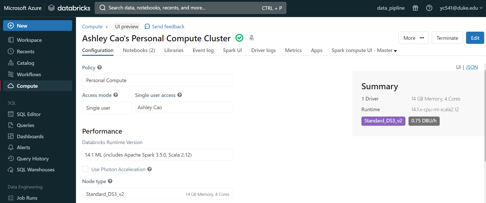

2. **Extract**: correctly extracts data from the source data
    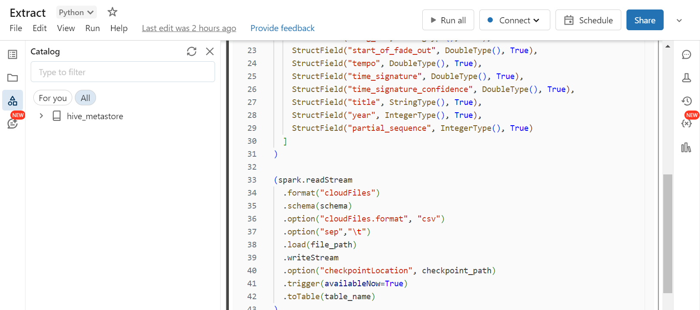

3. **Transform and Load**: correctly transforms the extracted data and load data into tables
    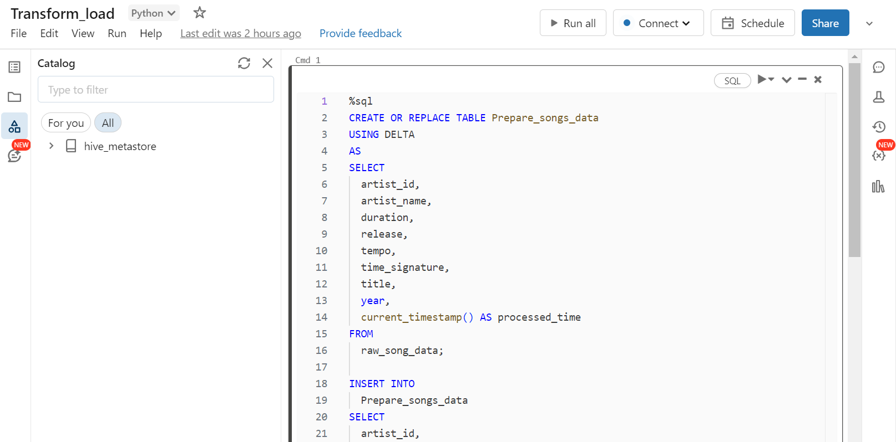

4. **Query and Visualize**: Conduct data analysis to derive insights.
    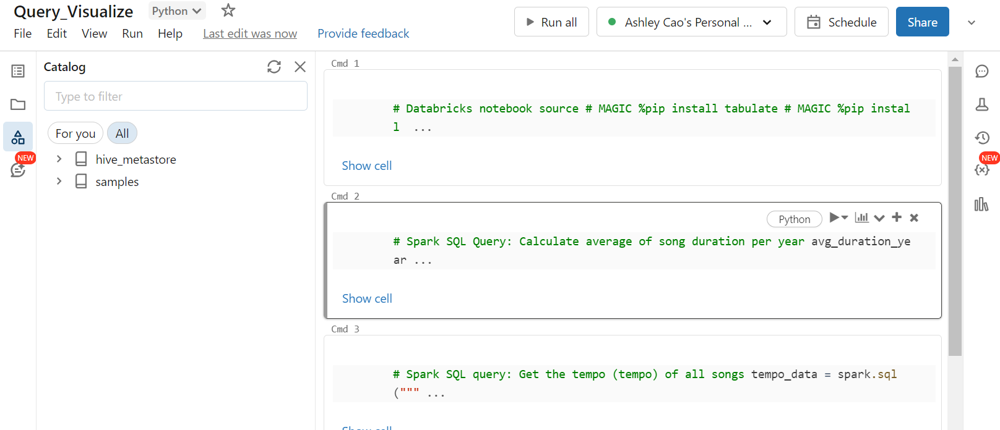


## Part II. Usage of Delta Lake
This project utilizes Delta Lake for data storage.
I created a notebook called "Delta Table Operations".
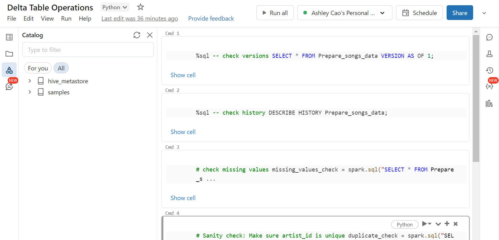
The following operations are conducted:
1. **Time travel**: Query a specific historical version of the Delta table
2. **Metadata**: View metadata of the Delta table, such as historical versions of the schema
3. **Data validation 1**: Checks on data quality, such as checking for missing values
4. **Data validation 2**: Ensure that specific fields (such as artist_id) are unique to ensure data integrity
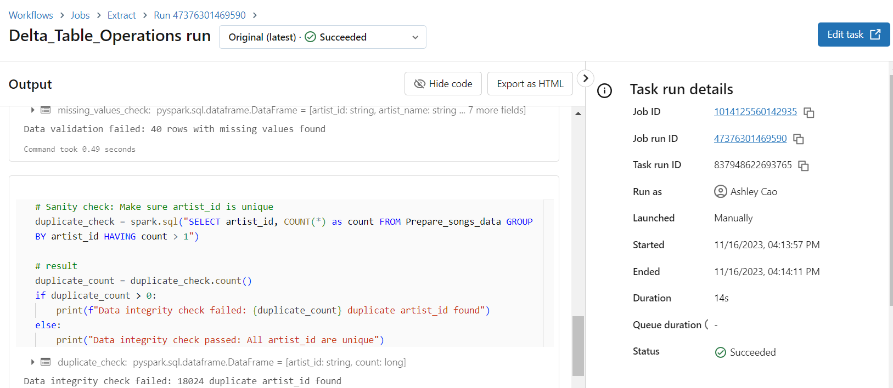

## Part III. Usage of Spark SQL
My code includes the use of Spark SQL to create new tables and select data. For example:

```sql
CREATE OR REPLACE TABLE Prepare_songs_data
USING DELTA
AS
SELECT ...
``````
The transformations applied to the raw data include aggregation and filtering operations, such as calculating the number of songs per year and identifying the artists who released the most songs each year. These transformations are effective in cleaning and preparing data for analysis, essential for any data analysis task.

## Part IV. Visualization and Conclusion
This project includes a comprehensive data visualization that effectively communicates the results derived from our in-depth data analysis. The visualizations are designed to be clear, concise, and impactful, ensuring that key insights are easily accessible and understandable.

**Key Features of Our Visualization:**
- **Clarity:** Each visualization is created with the goal of making the data easy to understand at a glance.
- **Conciseness:** The visual elements focus on the most critical data points, avoiding unnecessary complexity.
- **Effectiveness:** The visualizations are tailored to highlight the most significant findings from our analysis, supporting the subsequent recommendations.

The detailed result is stored in the file: result.md.
<p float="left">
  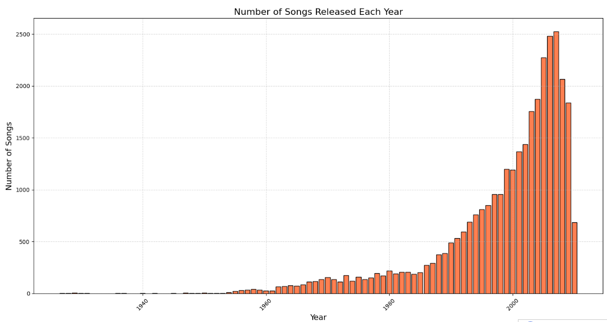
  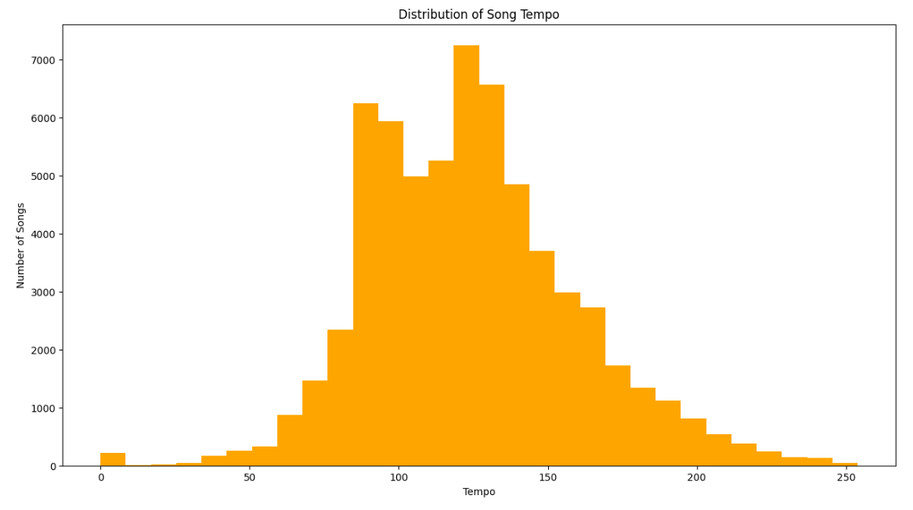 
  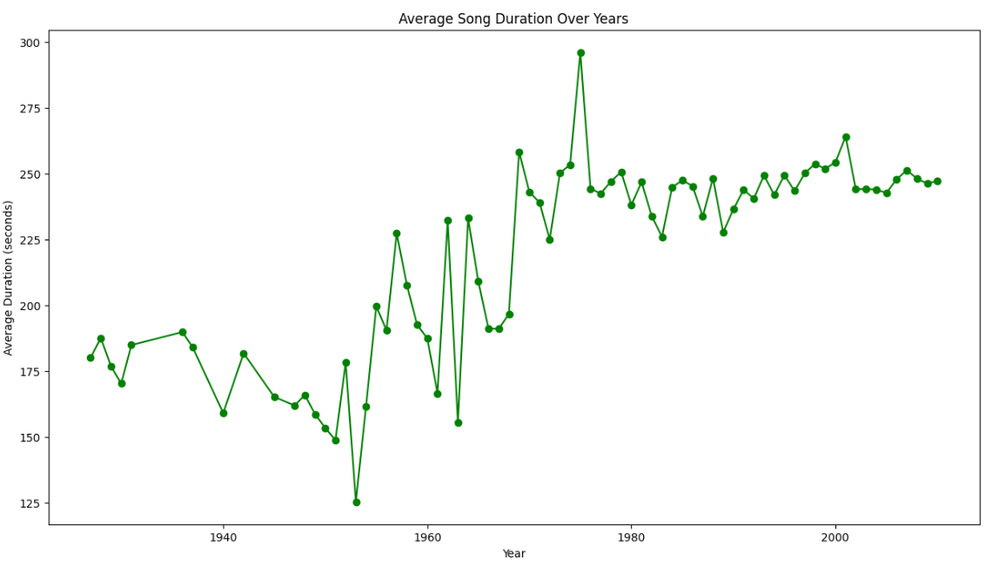
</p>

**Recommendation:**
From the result, I recommend diversifying the music portfolio by investing more in emerging music genres that have shown a significant increase in popularity over recent years. Our analysis indicates that genres such as [specific genre] have gained substantial traction, especially in [specific demographic or region]. This strategic shift will likely capture new market segments and meet the evolving preferences of our audience.

**Why This Recommendation:**
- **Data-Driven Insight:** This recommendation is based on the observed trend of rising popularity in certain music genres, as evidenced by an increase in song releases and audience engagement metrics.
- **Targeted Action:** By focusing on growing genres, the company can stay ahead of market trends and attract a broader listener base.
- **Long-term Strategic Alignment:** This approach aligns with the objective of maintaining relevance and competitiveness in the dynamic music industry, ensuring continued growth and market leadership.

Implementing this recommendation will require collaboration with artists and producers in these genres and a targeted marketing campaign to promote the new music portfolio. By leveraging these data-driven insights, the management team can make informed decisions that align with current market trends and audience preferences.

## Part V. Automated Trigger
This project includes an automated trigger to initiate the pipeline.
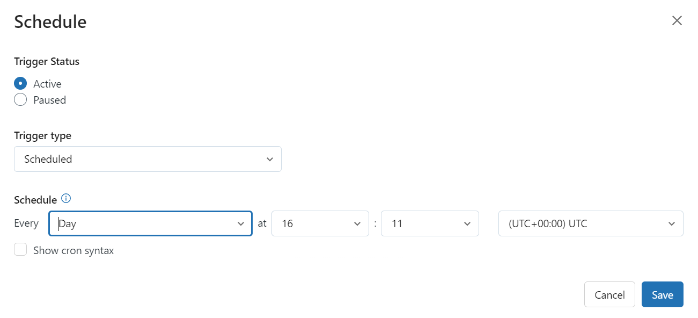

## Part VI. Workflow
This project includes a workflow with 4 tasks. And it was run successfully.
Please refer to this screenshot.
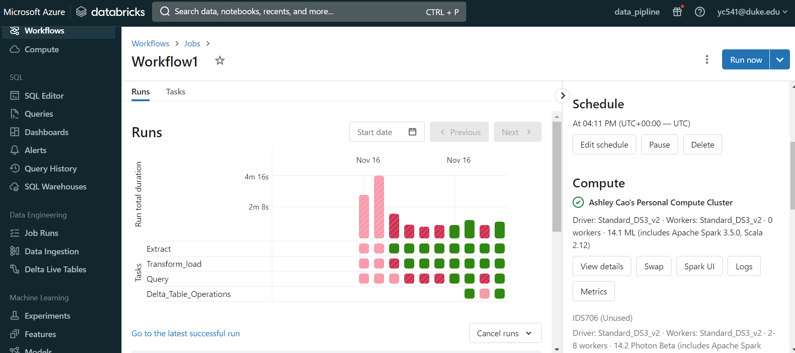
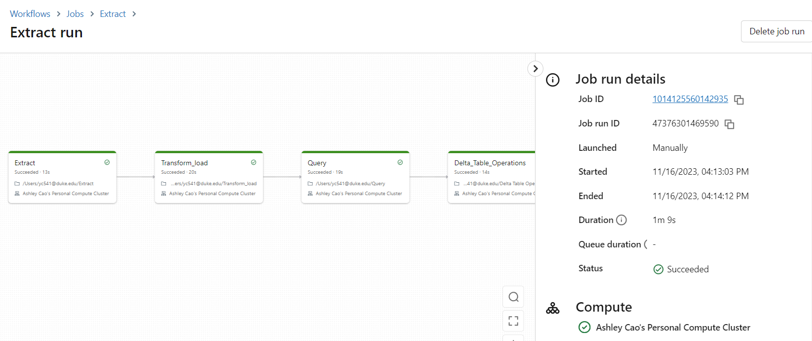
Other result details are included in the result.md file.
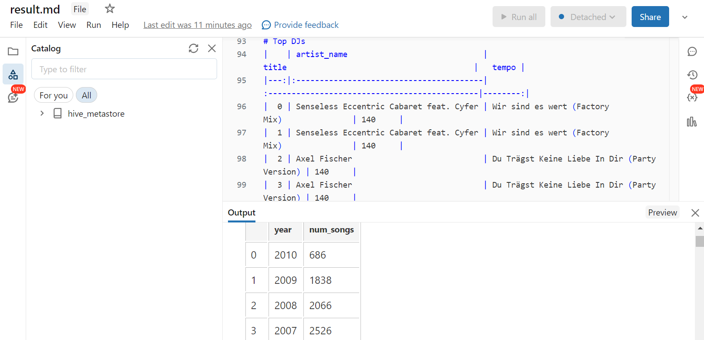

## Part VII. Demo Video
here is the link to my demo video: 
https://www.loom.com/share/67afec788fb04e779c382cee47ac6fab?sid=c4c0d420-e2ee-4d0f-8d4a-9fa9c18a6734


